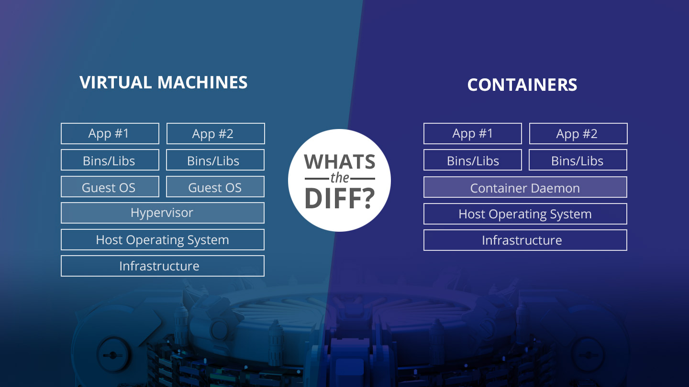

## Docker-Examples

### Docker

Is a tool designed to make it easier to create, deploy, and run applications by using containers. Containers allow a developer to package up an application with all of the parts it needs, such as libraries and other dependencies, and deploy it as one package. 

### Image
Read-only template that contains a set of instructions for creating a container that can run on the Docker platform. It provides a convenient way to package up applications and preconfigured server environments, which you can use for your own private use or share publicly with other Docker users.

### Dockerfile
Is a text document that contains all the commands a user could call on the command line to assemble an image

- FROM: To specify the parent image, example `FROM node:12`

- WORKDIR: To set the working directory for any commands that follow in the Dockerfile, example `WORKDIR /usr/src/app`

- RUN: To install any applications and packages required for your container.

- COPY: To copy over files or directories from a specific location.

- ADD: As COPY, but also able to handle remote URLs and unpack compressed files.

- ENTRYPOINT: Command that will always be executed when the container starts. If not specified, the default is /bin/sh -c

- CMD: Arguments passed to the entrypoint. If ENTRYPOINT is not set (defaults to /bin/sh -c), the CMD will be the commands the container executes.

- EXPOSE: To define which port through which to access your container application.

- LABEL: To add metadata to the image.

### Docker-Compose
Compose is a tool for defining and running multi-container Docker applications. With Compose, you use a Compose file to 
configure your application's services. Then, using a single command, you create and start all the services from your configuration

### Commands

- Build image: `docker build -t mtorre4580/my-app .`
- Show images: `docker images`
- Show process docker: `docker ps`
- Show logs inside container: `docker logs idContainer`
- In the container: `docker exec -t idContainer /bin/bash`
- Run image: `docker run -p PORT:PORT -d mtorre4580/my-app`
- Kill container: `docker kill idContainer`
- Remove image: `docker image rm -f idContainer`
- Run app with docker-compose: `docker-compose up`
- In a mongo: `docker exec -it idDelContainer bash`
- Down app: `docker-compose down`

### Install

https://docs.docker.com/get-docker/

    

