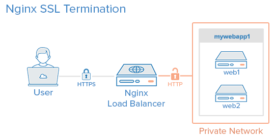

# Third App

## Goal
It is intended that they can apply docker-compose knowledge in a real world of various applications
A reverse proxy server is a type of proxy server that typically sits behind the firewall in a private network and directs client requests to the appropriate backend server. A reverse proxy provides an additional level of abstraction and control to ensure the smooth flow of network traffic between clients and servers.

    

- Create 2 sites that will simulate different applications as if they were microfrontenders (site1, site2)
- Create an index.html for site1, add something descriptive in the html to quickly identify it
- Create an index.html for site2, add something descriptive in the html to quickly identify it
- Create a docker-compose that uses the nginx image and exposes the application in the default port of the web (80)
- Create an nginx folder which will contain all the logic to be able to relate both sites and the nginx configuration
- Create the docker-compose for nginx, it must have the network enabled
- Create the default.conf of nginx by default put the names server_name site1.example.com, site2.example.com
- Add in your machine in /etc/hosts, so you can recognize dominion
- `127.0.0.1 site1.example.com`
- `127.0.0.1 site2.example.com`

## Run

- cd site1 `docker-compose up -d`
- cd site2 `docker-compose up -d`
- cd nginx `docker-compose up -d`

- if we enter localhost, we will see the not found page
- if we enter http://site1.example.com/ we will see the server on page 1
- if we enter http://site2.example.com/ we will see the server on page 2

## Hints

- Use Nginx image https://hub.docker.com/_/nginx
- Nginx https://www.nginx.com/nginx-wiki/build/dirhtml/start/

