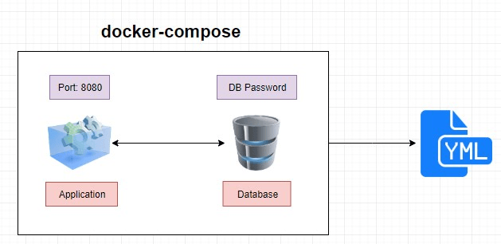

# Second App

## Goal
It is intended that they can create an application that uses several services and is related to each other using docker-compose

    

- Create a basic nodejs application with express and mongo (only 2 files)
- Create a connection file to handle the connection to mongodb (connection.js)
- Create an endpoint that returns items per site using the public endpoint https://developers.mercadolibre.com.ar/es_ar/items-y-busquedas
- Create an endpoint "/cache" that saves the endpoint search in mongoDB, where the key is the search url
- Reuse the same dockerfile from the basic
- Create a docker-compose.yml which has 2 services "web" and "mongo", they have to be linked
- Run App with `docker-compose up`
- Test App

## Hints

- Same file Dockerfile (basic)

- Image for mongo https://hub.docker.com/_/mongo
